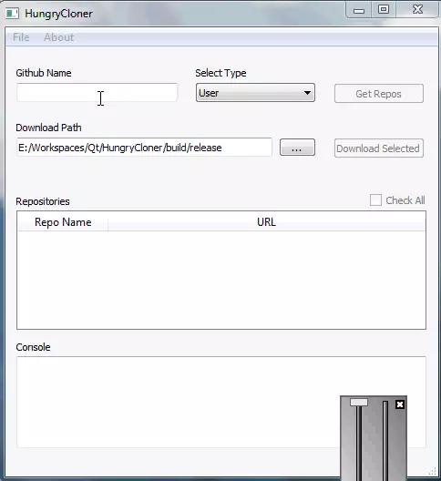

# HungryCloner

HungryCloner is a simple GUI application written in C++ with QT Framework. This app helps to download all public repositories of an user/organization on Github.

# Todo
- [x] GUI Design
- [x] Implement inter active features
    - [x] Interactive buttons
- [x] Gather all repo urls of user
- [x] Collect the selected items
- [x] Download and Store

# Screenshots

> Working Preview
